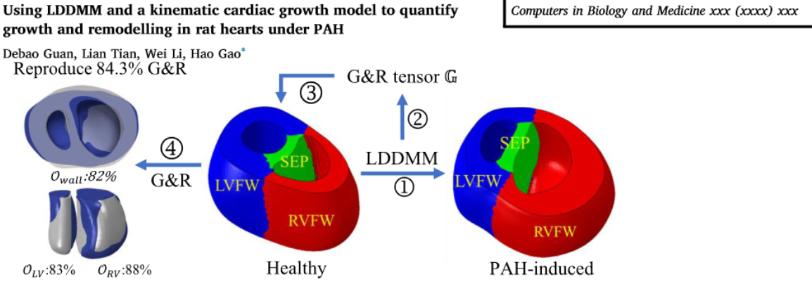

## Using LDDMM and a kinematic cardiac growth model to quantify growth and remodelling in rat hearts under PAH (CBM 2024)

Online version: 

This respository contains the model files for the above paper published in Computers in Biology and Medicine. Please cite the paper if you use the code:

```
@article{Guan_LDDMM_2024,
	journal={ Computers in Biology and Medicine},
	title={Using LDDMM and a kinematic cardiac growth model to quantify growth and remodelling in rat hearts under PAH},
	author={Guan, Debao and Tian, Lian and Li, Wei and Gao, Hao},
	volume={accepted},
    year={2024}
}
```

