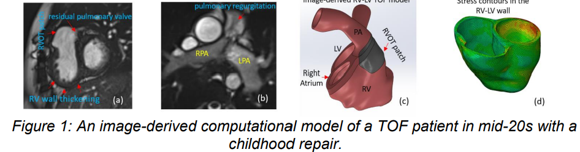

## Computational modelling of Tetralogy of Fallot

This repository dedicates to the  funded BHF project "A MODELLING STUDY OF RIGHT VENTRICULAR FUNCTION IN REPAIRED TETRALOGY OF FALLOT FOR PREDICTING OUTCOME AND IMPACT OF PULMONARY VALVE REPLACEMENT", 2022 - 2025.

Tetralogy of Fallot (TOF) is a common congenital heart condition, occurring in approximately 1 in 3500 births that is repaired in infancy. Despite significant advancements in the clinical care of these patients, the life expectancy of adults with repaired TOF is diminished compared to the general population. Pulmonary valve replacement, undertaken in adult repaired TOF, can improve heart function and patient wellbeing, but its effect on long-term outcome is less certain. TOF patients are routinely evaluated using heart scans which provide a wealth of information about
their heart anatomy and function. However, this information is complex and data-rich and contains hidden in various physical and biological laws that are beyond the appreciation of the in-clinic doctors who manage these patients. We will develop new computational models based on patient scan data using cutting-edge mathematical and statistical approaches to derive parameters of heart function that will provide valuable insights into the cardiac condition for doctors and patients. The project will use heart scans from patients with repaired TOF with and without pulmonary valve replacements, computer-based models will be evaluated to inform
doctors' decision-making in selecting which patients will benefit from the pulmonary valve intervention and the optimal timing of this intervention.

## Investigators:

Dr Hao Gao; Prof Mark Danton; Prof Colin Berry; Prof Nick Hill; Prof Xiaoyu Luo; Prof Dirk Husmeier; Dr Debao Guan. 

